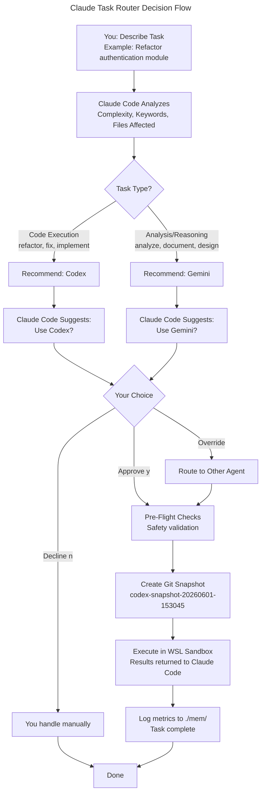

# Claude Task Router

**Intelligently route complex tasks from Claude Code to specialized agents.** Instead of doing everything in Claude Code (expensive in tokens), this skill analyzes each task and routes it to the agent best suited for the job: **Codex** for code execution, **Gemini** for analysis and reasoning. Get safer execution with pre-checks and rollback capability.

## Table of Contents

- [Why This Exists](#why-this-exists)
- [How It Works](#how-it-works)
- [Installation](#installation)
- [Quick Start](#quick-start)
- [Agent Selection](#agent-selection)
- [Safety & Rollback](#safety--rollback)
- [Requirements](#requirements)
- [Troubleshooting](#troubleshooting)
- [Metrics & History](#metrics--history)
- [Uninstall](#uninstall)
- [License](#license)

## Why This Exists

Running complex tasks entirely in Claude Code is **expensive in tokens** and **unsafe without guardrails**. Refactoring a 10-file module, analyzing a new architecture, or migrating a database schema — these aren't simple tasks. They need:

- **Specialized agents** — Code execution and reasoning are different skill sets
- **Safety gates** — Block dangerous operations (rm -rf, DROP TABLE, git reset --hard) before they run
- **Rollback capability** — Easy recovery if something goes wrong
- **Token efficiency** — Offload heavy lifting to specialized models

This skill solves all of it. Claude Code stays in control, recommends the best agent for your task, you approve, and execution happens with safety and auditability built in.

## How It Works



**Step-by-step example:**

```powershell
You: "Refactor the authentication module to use async/await"
  ↓
Claude Code analyzes:
  - Keywords: "refactor", "async/await" → code execution
  - Estimated impact: 7+ files
  - Complexity: HIGH (95% confidence)
  ↓
Claude Code: "This is a code task. I recommend routing to Codex.
             Codex specializes in refactoring. Proceed? (y/n)"
  ↓
You: "y"
  ↓
Pre-flight check: Safety validation passes
Git snapshot: codex-snapshot-20260601-153045 (created)
Execution: wsl -d Ubuntu -- codex "Refactor the authentication module..." -a on-request -s workspace-write
  ↓
Results returned. You can see changes.
If something's wrong: git stash pop codex-snapshot-20260601-153045 to roll back instantly.
```

## Installation

> [!IMPORTANT]
> Requires PowerShell 7+, Git, and WSL Ubuntu. At least one agent (Codex or Gemini) is required.

### Automatic (Recommended)

```powershell
/install claude-codex-gemini-router-skill
```

The skill will:
1. Copy hook scripts to `~/.claude/hooks/`
2. Wire hooks into `~/.claude/settings.json`
3. Validate Codex and Gemini CLIs
4. Enable routing immediately for all projects

### Manual Installation

**Install Codex only:**
```powershell
.\scripts\Install-Codex.ps1
```

**Install Gemini only:**
```powershell
.\scripts\Install-Gemini.ps1
```

**Install both (recommended):**
```powershell
.\scripts\Install-Codex.ps1
.\scripts\Install-Gemini.ps1
```

## Quick Start

1. **Install the skill:**
   ```powershell
   /install claude-codex-gemini-router-skill
   ```

2. **Validate installation:**
   ```powershell
   .\scripts\Validate-Codex.ps1
   .\scripts\Validate-Gemini.ps1
   ```
   Both should report "✓ CLI found" and "✓ Hooks configured".

3. **Give Claude Code a complex task:**
   ```
   You: "Analyze the API endpoints and document the authentication flow"
   ```

4. **Claude Code recommends an agent:**
   ```
   Claude Code: "This is an analysis task. I recommend Gemini.
                Route to Gemini? (y/n)"
   ```

5. **Approve or override:**
   - Type `y` to accept the recommendation
   - Type `n` to handle it yourself
   - Type the agent name (codex/gemini) to override

6. **Execution happens with safety:**
   - Pre-flight checks block dangerous operations
   - Git snapshot created for rollback
   - Agent executes in isolated sandbox
   - Results logged to `./mem/`

## Agent Selection

### Route to Codex

**Use for code execution tasks:**
- refactor, rewrite, migrate, upgrade
- fix, debug, patch, optimize
- implement, build, integrate, enhance

**Example tasks:**
- "Refactor the authentication module"
- "Fix the memory leak in the cache handler"
- "Implement OAuth2 support"

### Route to Gemini

**Use for analysis and reasoning tasks:**
- analyze, review, assess, evaluate
- document, explain, understand, clarify
- design, architect, plan, research

**Example tasks:**
- "Analyze the API design and document patterns"
- "Review the database schema for optimization opportunities"
- "Design a new caching strategy"

## Safety & Rollback

Every execution is protected:

### Pre-Flight Checks
Blocks dangerous operations automatically:
- `rm -rf`, `DELETE FROM`, `DROP TABLE`
- `git push --force`, `git reset --hard`
- `chmod 777`, `sudo`, `reboot`
- Shell injection patterns

### Git Snapshots
Before Codex or Gemini executes, a git snapshot is created with a descriptive label:
```powershell
git stash list
# stash@{0}: codex-snapshot-20260601-153045: Refactor auth module
# stash@{1}: gemini-snapshot-20260601-152103: Analyze API design

# To rollback instantly:
git stash pop codex-snapshot-20260601-153045
```

### Sandbox Constraints
Agents run in isolated WSL environment with limited permissions (`workspace-write` only — no system access).

## Requirements

| Requirement | Version | Notes |
|---|---|---|
| Claude Code | Latest | The AI assistant running this skill |
| PowerShell | 7+ | WSL integration requires modern PowerShell |
| Git | Any | For snapshots and rollback |
| WSL Ubuntu | 20.04+ | Agents execute in WSL, not native Windows |
| Codex CLI | Optional | `pip install codex-cli` (or in WSL: `apt install codex`) |
| Gemini CLI | Optional | See [Gemini CLI docs](https://github.com/google-ai-sdk/generative-ai-python) |

At least **one agent** (Codex or Gemini) is required for routing. Both are recommended.

## Project Structure

```
scripts/
├─ Route-ToCodex.ps1           Route task to Codex subprocess
├─ Route-ToGemini.ps1          Route task to Gemini subprocess
├─ Install-Codex.ps1           Install Codex integration globally
├─ Install-Gemini.ps1          Install Gemini integration globally
├─ Validate-Codex.ps1          Check Codex CLI and config
├─ Validate-Gemini.ps1         Check Gemini CLI and config
├─ Analyze-TaskComplexity.ps1  Detect task complexity tier
├─ Restore-Snapshot.ps1        Interactive git rollback
└─ View-Metrics.ps1            View execution history

hooks/
├─ pre-tool-safety.ps1         Block dangerous operations
├─ pre-codex-snapshot.ps1      Git snapshot before Codex
└─ pre-gemini-snapshot.ps1     Git snapshot before Gemini

config/
├─ hooks.json                  Safety patterns and routing rules
├─ complexity-tiers.json       Tier definitions (LOW/MEDIUM/HIGH/CRITICAL)
├─ settings.json.template      Codex configuration template
└─ gemini-settings.json.template Gemini configuration template
```

## Troubleshooting

### Codex CLI not found

```powershell
# Check if installed:
codex --version

# Install if needed:
pip install codex-cli

# Or in WSL Ubuntu:
wsl -d Ubuntu -- sudo apt install codex
```

### Gemini CLI not found

Check the [Gemini CLI installation guide](https://github.com/google-ai-sdk/generative-ai-python).

### Hooks not running

Verify installation completed:
```powershell
.\scripts\Validate-Codex.ps1
.\scripts\Validate-Gemini.ps1
```

Both should show:
```
✓ CLI found
✓ settings.json configured
✓ Hooks wired
```

If not, re-run installers:
```powershell
.\scripts\Install-Codex.ps1
.\scripts\Install-Gemini.ps1
```

### Git snapshot failed

Ensure you're in a git repository with tracked files:
```powershell
git status
git log --oneline | head -5

# If not initialized:
git init
git add .
git commit -m "initial commit"
```

> [!WARNING]
> Snapshots require an initialized git repo with at least one commit.

### WSL Ubuntu not found

Install WSL:
```powershell
wsl --install -d Ubuntu
```

Launch it once to finish setup, then retry routing.

## Metrics & History

View execution history and metrics:

```powershell
.\scripts\View-Metrics.ps1
```

Shows:
- Total tasks routed by tier
- Success/failure rates
- Recent execution list with timestamps

Detailed logs are stored in `./mem/YYYYMMDD-session.md`:
```markdown
# Session Log - 2026-06-01

### 10:30 - Task Routing Decision
- Task: Refactor authentication module
- Complexity: HIGH (95% confidence)
- Recommended: Codex
- User approval: yes
- Snapshot: codex-snapshot-20260601-103045
- Status: Success

### 11:15 - Task Routing Decision
- Task: Analyze API design patterns
- Complexity: HIGH (88% confidence)
- Recommended: Gemini
- User approval: yes
- Snapshot: gemini-snapshot-20260601-111532
- Status: Success
```

## Uninstall

To remove both integrations:

```powershell
.\scripts\Install-Codex.ps1 -Uninstall
.\scripts\Install-Gemini.ps1 -Uninstall
```

This restores your backed-up `~/.claude/settings.json` and removes hook scripts.

## Support

- **GitHub**: [thisisgaganbirru/claude-codex-gemini-router-skill](https://github.com/thisisgaganbirru/claude-codex-gemini-router-skill)
- **Issues**: Report bugs and feature requests via GitHub Issues
- **Docs**: See [SKILL.md](./SKILL.md) for technical deep dive
- **References**: See `references/` directory for guides on approval policies and routing

## License

MIT — See [LICENSE](./LICENSE) for details.

---

**Ready to use less tokens and get safer execution?**

```powershell
/install claude-codex-gemini-router-skill
```
